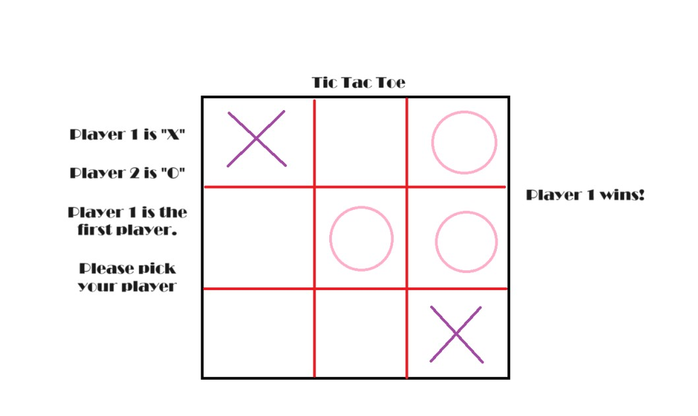

:warning: Everything between << >> needs to be replaced (remove << >> after replacing)

# << Project Title >>
## CS110 Final Project  << 1st Semester, 2023 >>

## Team Members

Saloni Paresh Mahyavanshi,
Athira Unnikrishnan

***

## Project Description

It is a game of tic tac toe. There will be two players. The players will be assigned X or O. Player 1 will be X and player 2 will be O. The players will draw X/O wherever they want on the grid, alternatively. The first to have X/O in 3 consecutive boxes (horizontally, vertically or diagonally) wins.

***    

## GUI Design

### Initial Design

### Final Design

## Program Design

### Features

1. Start Menu 
2. Instruction Page
3. Choosing X and O player
4. Game Board
5. Game Over and Start Again

### Classes

- Controller
- Model
- Main

## ATP

Test Case 1: Tic Tac Toe

Test Description: Verify that the next page to show up would be the instructions or the game according to what the players choose.

Test Steps:
1. Start the game.
2. Press the 'Start Game' key.
3. Verify that the game starts asking to choose the shape.
4. Press the 'Instructions' key.
5. Verify that the next page shows the instructions of how to play the game.

Expected Outcome: the next page to show up would be the instructions or the game according to what the player chooses.

Test Case 2: 3 in a Row Pattern

Test Description: Verify that the "O"s are three in a row vertically, horizontically, or diagonally.

Test Steps:
1. Start the game.
2. Choose "O" or "X"
3. First the player 1 would occupy a space then the player 2 would occupy a space. The game would continue until "O"s or "X"s appear three in a row vertically, horizontically, or diagonally.
4. Verify the game identify's the pattern by making sure the display changes to Game Over page. 

Expected Outcome: The display would change when either the player 1 or the player 2 occupies three spaces in a row vertically, horizontically, or diagonally.

Test Case 3: Choose the shape for the player

Test Description: Saving what shape the players choose

Test Steps:
1. Start the game
2. Press the 'Start Game; button
3. A page with two options - 'O' and 'X'- will appear.
4. Players can choose whichever shape they like.
5. The shape they choose will be saved for them.

Expected Outcome: When the game starts, and the player clicks a spot to enter their shape, the chosen shape only will be inserted

Test Case 4: Game Over Condition

Test Description: Confirm that the game ends when the player 1 wins, loses, or ties with the player 2.
Test Steps:
1. Start the game.
2. Play until either the player 1 or the player 2 wins.
3. Verify that the code that checks the conditions for a win by printing a string confirming a win.

Expected Outcome: The terminal will have a "We have a winner!" desplayed on it.

Test Case 5: Error Handling

Test Description: Verify that the program handles unexpected inputs gracefully.
Test Steps:
1. Start the game.
2. Player 1 or player 2 tries to occupy a already occupied space in the game board.
3. Verify that the program does not crash and displays appropriate error messages and a restart button.

Expected Outcome: The program should handle unexpected overlaps without crashing and display user-friendly error messages and a restart button.

Things to Know:
1) Part of the code that involves debugging dissapeared due to mearging conflicts.
2) The screen refuses to show up, a black screen for a few seconds.
